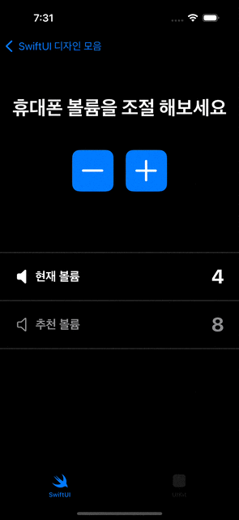

# SwiftDesignLab

<div align="center">
  
</div>

<br/>
좋은 디자인과 UX를 SwiftUI와 UIKit으로 구현해보는 디자인 실험실입니다.

## 프로젝트 소개

SwiftDesignLab은 iOS 개발에서 자주 사용되는 디자인 패턴과 사용자 경험(UX) 요소들을 실제 코드로 구현하고 실험하는 프로젝트입니다. SwiftUI와 UIKit 두 가지 프레임워크를 모두 활용하여 다양한 디자인 접근 방식을 탐구합니다.

### 아키텍처

```
SwiftDesignLab/
├── App/                   # 앱 진입점
├── Coordinator/           # 코디네이터 패턴
│   ├── Core/             # 코디네이터 핵심 구현
│   ├── SwiftUI/          # SwiftUI 탭 코디네이터
│   └── UIKit/            # UIKit 탭 코디네이터
├── View/                  # 뷰 계층
│   ├── Common/           # 공통 뷰 컴포넌트
│   ├── SwiftUI/          # SwiftUI 탭
│   └── UIKit/            # UIKit 탭
├── Model/                 # 데이터 모델
├── DI/                   # 의존성 주입
└── Asset/                # 앱 리소스
```

## SwiftUI

### 1. FitVolumeView
`FitVolumeView`는 "Nightly" 라는 앱에서 발견한 디자인을 참고했습니다.  
사용자가 휴대폰 볼륨을 조절할 때 추천 볼륨과 일치하는 순간에 뷰가 하나로 합쳐집니다.  
타겟하는 볼륨에 맞춰지는게 시각적으로 보여서 엄청 직관적이네요.



### 2. SlidePayView
`SlidePayView`는 "스타벅스" 앱에서 간편 결제를 진행할 때 발견한 디자인을 참고했습니다.  
옛날 아이폰의 밀어서 잠금해제가 생각나네요. 저는 86% 이상부턴 손을 놓으면 끝까지 차도록 해두었는데,  
어느 지점에서 결제가 진행되는지 사용자에게 피드백이 필요할 것 같아서 햅틱 피드백을 넣었습니다.


### 3. BlinkStarView
`BlinkStarView`는 "Tesseract" 앱의 온보딩 디자인의 배경화면을 보고 참고했습니다.  
해당 앱은 고정된 위치에서 별이 깜빡이는데, 랜덤성을 주면 더 재밌을 것 같아,  
별들의 위치, 색상, 애니메이션, 속도, 크기 등 최대한 랜덤하게 나오도록 설정했습니다.


## 라이선스

이 프로젝트는 MIT 라이선스 하에 있습니다. 자세한 내용은 [LICENSE.md](LICENSE.md) 파일을 참조하세요.
